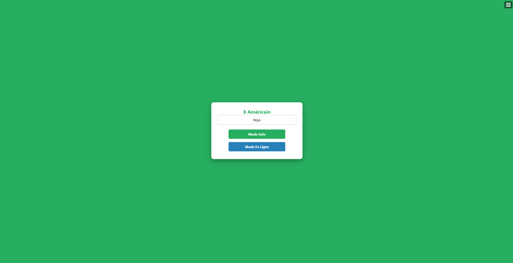
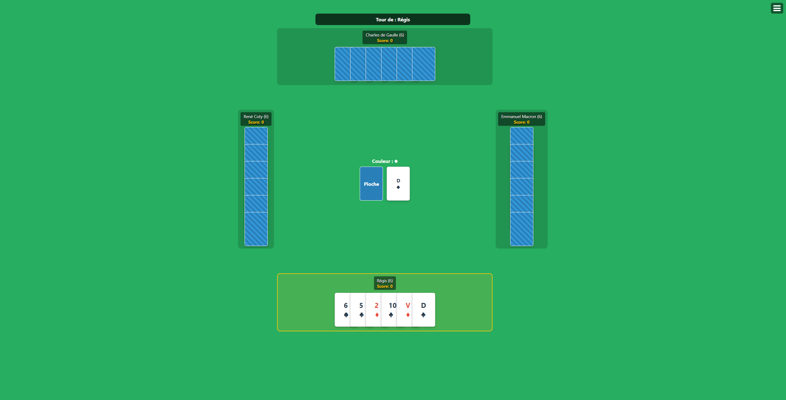
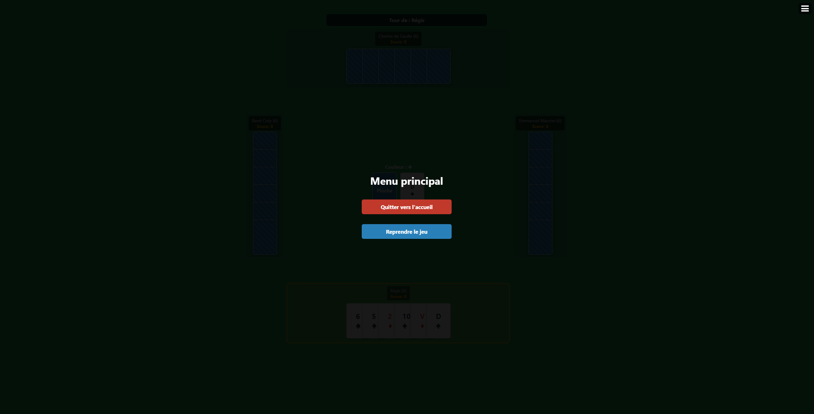

# 8 Américain - Multijoueur & Solo

Un jeu de cartes du 8 Américain jouable en ligne sur navigateur, développé en Node.js et Socket.io. Il inclut un mode multijoueur en temps réel et un mode solo contre des IA (bots).

## Captures d'écran

| Accueil | Partie en cours | Menu en jeu |
|---|---|---|
|  |  |  |

## Fonctionnalités
- **Mode Solo** : jouez contre 3 IA de manière fluide.
- **Mode En Ligne** : matchmaking automatique pour regrouper 4 joueurs (complété par des bots après 60 s).
- **Règles avancées** :
  - Le 7 fait rejouer immédiatement.
  - Le 8 permet de changer la couleur en cours.
  - Le 10 inverse le sens du jeu.
  - Pioche automatique intelligente si aucune carte n'est jouable.
- **Score** : système de points classique, la partie complète s'arrête à 200 points.
- **Responsive** : interface adaptée aux PC, tablettes et smartphones.

## Installation

```bash
git clone https://github.com/regis57/8americain.git
cd 8americain
npm install
npm start
```

Le jeu est accessible sur `http://localhost:3000`. Le port se règle avec la variable d'environnement `PORT`.

## Licence

Ce projet est distribué sous licence **GNU Affero General Public License v3.0 ou ultérieure** (AGPL-3.0-or-later). Voir le fichier [LICENSE](LICENSE).

Si vous hébergez une version modifiée de ce jeu accessible par le réseau, l'AGPL vous oblige à en proposer le code source complet à vos utilisateurs.
